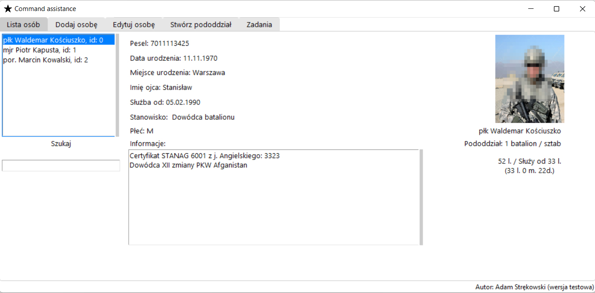
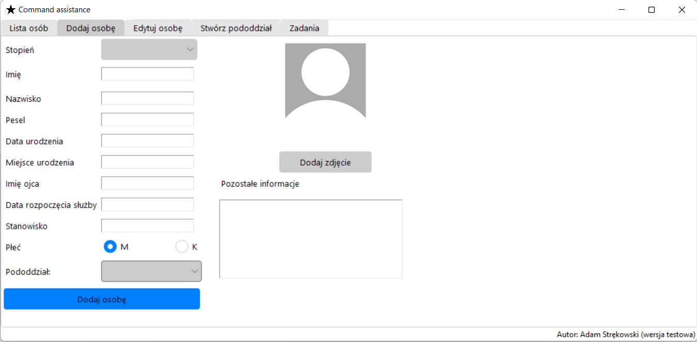
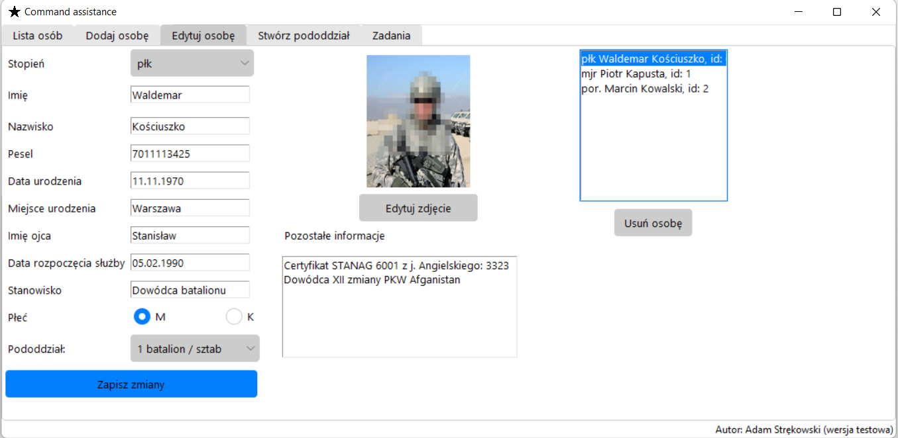
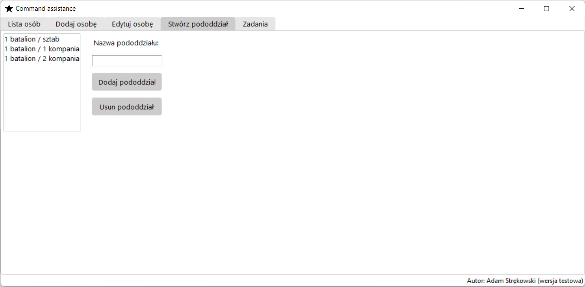
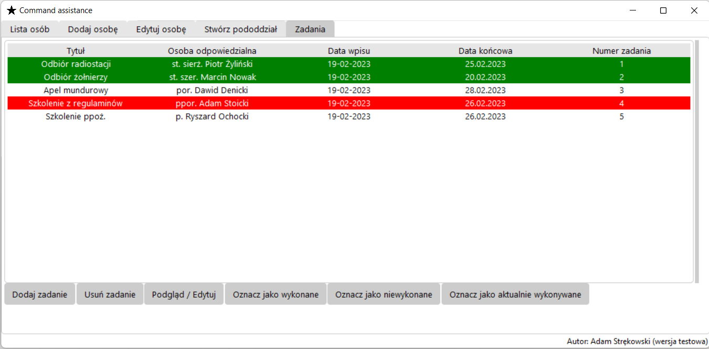

# Command-assistance
The "command assistance" program aims to streamline human resources management for leaders at all levels. It allows for clear input of information about soldiers or civilian employees, as well as quick searching of information about them.

The program was written using Python and several libraries. The database is based on sqlite3.

By default, there is a database named "persons_list". The database is empty. In case of its removal, it is necessary to remove the "#" sign before three lines of code to create tables in the database again. These are the following lines of code:

1. #c.execute("""CREATE TABLE persons (rank text, first_name text, last_name text, pesel text, date_of_birth text, place_of_birth text, father_name text, date_of_join text, position text, gender text, adnotations text, photo text, subdivision text, id integer)""")
2. #c.execute("CREATE TABLE subdivisions (subdivision text)")
3. #c.execute("CREATE TABLE tasks (title text, responsible text, entryDate text, endDate text, taskId integer, describe text, tag text)")

The first tab allows you to browse the information entered about human resources. In addition to basic data, the age of the person and the length of their service are calculated. There is also a search function that takes into account: rank, first name, last name, ID number, place of birth, description, and subunit.

The second tab is used to enter people. It is possible to select a subunit, which is entered in another tab.

The edit tab is used to edit previously entered data.

The "subdivisions" tab is used to manage subunits.

The tasks tab is used to manage current tasks. In addition to adding, deleting, and editing tasks, it is also possible to mark tasks as white/red/green, which means tasks in progress, tasks completed, and tasks not completed. By clicking on the "preview/edit" button, you can get detailed information about the task.

The program allows for adding many other features in the future. If you feel like improving something, you are welcome to do so.
Author: Adam Strękowski

Contact: adam.strekowski@gmail.com

Some screenshots

